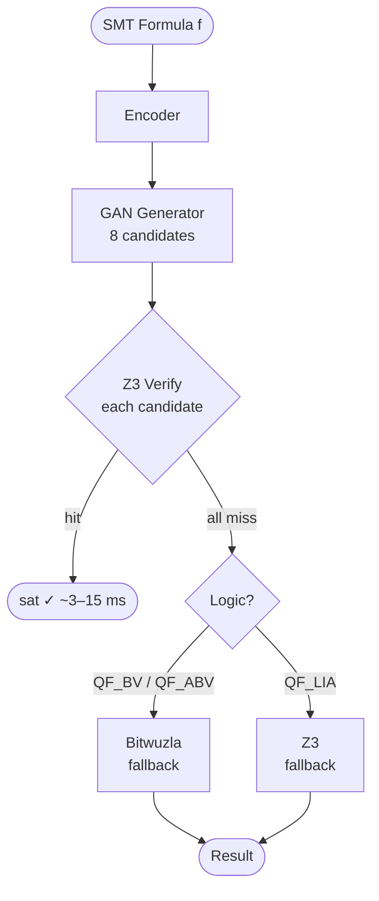
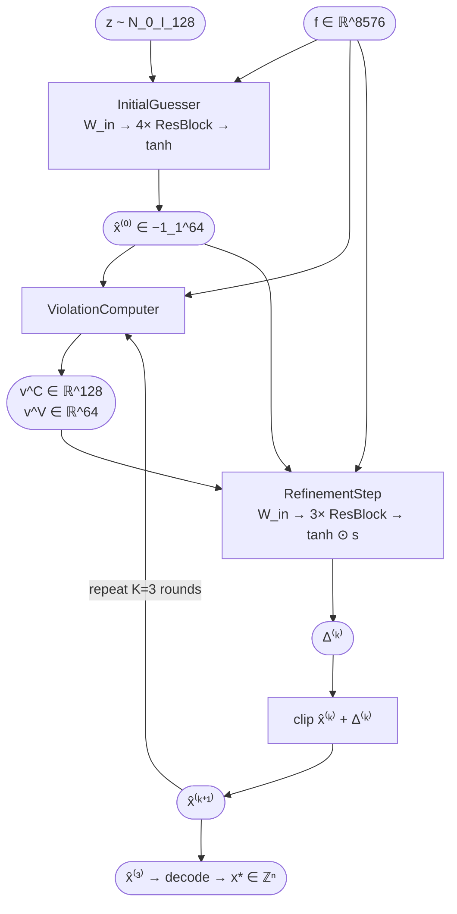
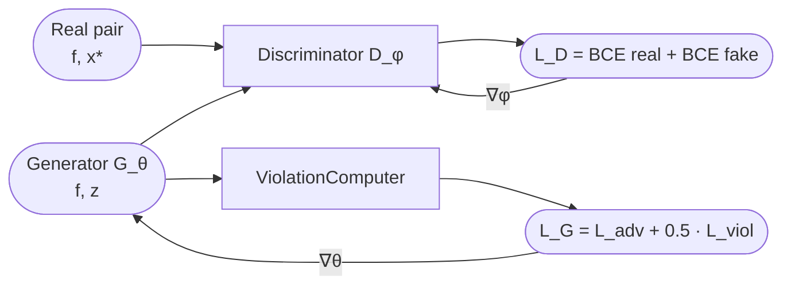
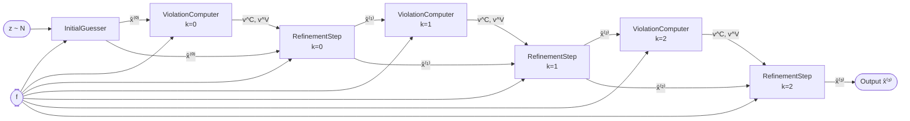

# GANSAT — Mathematical Specification

**NeuroSym: Iterative Refinement GAN for SMT Solving**
SMT-COMP 2026 — QF_LIA / QF_BV / QF_ABV

---

## Architecture Overview

### Solving Pipeline

### GAN Generator — Iterative Refinement

### Training Loop

---

## 1. Problem Formulation

### 1.1 SMT Satisfiability (QF_LIA)

A QF_LIA formula $\varphi$ over integer variables $\mathbf{x} = (x_1, \ldots, x_n)$ is a conjunction of linear constraints:

$$\varphi(\mathbf{x}) = \bigwedge_{i=1}^{m} C_i(\mathbf{x})$$

| Type | Form | Index |
|------|------|-------|
| $\leq$ | $\mathbf{a}_i^\top \mathbf{x} \leq b_i$ | 0 |
| $=$ | $\mathbf{a}_i^\top \mathbf{x} = b_i$ | 1 |
| $\geq$ | $\mathbf{a}_i^\top \mathbf{x} \geq b_i$ | 2 |
| $\neq$ | $\mathbf{a}_i^\top \mathbf{x} \neq b_i$ | 3 |

where $\mathbf{a}_i \in \mathbb{Z}^n$, $b_i \in \mathbb{Z}$.

$$\text{SAT}(\varphi) = \begin{cases} \text{sat} & \exists\, \mathbf{x}^* \in \mathbb{Z}^n \text{ s.t. } \varphi(\mathbf{x}^*) = \top \\ \text{unsat} & \forall\, \mathbf{x} \in \mathbb{Z}^n,\; \varphi(\mathbf{x}) = \bot \end{cases}$$

### 1.2 GANSAT Objective

GANSAT learns a generator $G_\theta : \mathcal{F} \times \mathcal{Z} \to [-1,1]^{d_x}$ that maps a formula encoding $\mathbf{f} \in \mathcal{F}$ and noise $\mathbf{z} \sim \mathcal{N}(0, I)$ to a candidate assignment $\hat{\mathbf{x}}$, decoded to integers via variable bounds.

---

## 2. Formula Encoding

### 2.1 Normalization Constants

$$\kappa_b = 10^4 \quad \text{(bound clip)}, \qquad \kappa_c = 10^4 \quad \text{(coefficient clip)}$$

### 2.2 Variable Bounds Block

$$\mathbf{f}^{\text{bounds}} \in \mathbb{R}^{2 d_x}, \quad d_x = 64$$

$$f^{\text{bounds}}_{2j} = \frac{\text{clip}(\ell_j,\,-\kappa_b,\,\kappa_b)}{\kappa_b}, \qquad f^{\text{bounds}}_{2j+1} = \frac{\text{clip}(u_j,\,-\kappa_b,\,\kappa_b)}{\kappa_b}$$

### 2.3 Constraint Matrix Block

For each constraint $i \in \{1,\ldots,m\}$, $m = 128$:

$$\mathbf{f}^{\text{row}}_i = \left[\frac{a_{i,1}}{\kappa_c},\;\ldots,\;\frac{a_{i,d_x}}{\kappa_c},\;\frac{b_i}{\kappa_b},\;t_i\right] \in \mathbb{R}^{d_x+2}$$

### 2.4 Full Formula Encoding

$$\mathbf{f} = \left[\mathbf{f}^{\text{bounds}} \;\Big|\; \text{vec}\!\left(\mathbf{f}^{\text{row}}_1,\ldots,\mathbf{f}^{\text{row}}_m\right)\right] \in \mathbb{R}^{d_f}$$

$$d_f = 2d_x + m(d_x+2) = 2(64)+128(66) = \boxed{8576}$$

### 2.5 Assignment Encoding / Decoding

$$\hat{x}_j = \text{clip}\!\left(\frac{x_j}{\kappa_b},\,-1,\,1\right) \quad \text{(training)}$$

$$x_j = \text{round}\!\left(\ell_j + \frac{\hat{x}_j+1}{2}(u_j-\ell_j)\right) \in \mathbb{Z} \quad \text{(inference)}$$

---

## 3. Residual Block

All subnetworks share $\text{ResBlock} : \mathbb{R}^d \to \mathbb{R}^d$:

$$\text{ResBlock}(\mathbf{h}) = \text{LeakyReLU}_{0.2}\!\Big(\mathbf{h} + \text{LN}\big(W_2\,\text{Drop}_{0.1}\!\left(\text{LeakyReLU}_{0.2}(\text{LN}(W_1\mathbf{h}+\mathbf{b}_1))\right)+\mathbf{b}_2\big)\Big)$$

- $W_1, W_2 \in \mathbb{R}^{d \times d}$
- $\text{LN}(\mathbf{h}) = \frac{\mathbf{h}-\mu}{\sigma+\epsilon}\odot\boldsymbol{\gamma}+\boldsymbol{\beta}$
- $\text{Drop}_{0.1}$: dropout $p=0.1$
- $\text{LeakyReLU}_{0.2}(z) = \max(0.2z,\,z)$

---

## 4. ViolationComputer

### 4.1 Constraint Matrix Extraction

$$A = \mathbf{F}^C_{[:,:d_x]} \in \mathbb{R}^{m\times d_x}, \quad \mathbf{b} = \mathbf{F}^C_{[:,d_x]} \in \mathbb{R}^m, \quad \mathbf{t} = \mathbf{F}^C_{[:,d_x+1]} \in \mathbb{R}^m$$

### 4.2 Linear Combination

$$\mathbf{p} = A\hat{\mathbf{x}} \in \mathbb{R}^m, \qquad \boldsymbol{\delta} = \mathbf{p}-\mathbf{b} \in \mathbb{R}^m$$

### 4.3 Type Masks

$$M^{\leq}_i = \mathbb{1}[t_i<0.25], \quad M^{=}_i = \mathbb{1}[0.25\leq t_i<0.75], \quad M^{\geq}_i = \mathbb{1}[0.75\leq t_i<1.25]$$

### 4.4 Per-Constraint Violation Score

$$v_i = \text{ReLU}(\delta_i)\cdot M^{\leq}_i + |\delta_i|\cdot M^{=}_i + \text{ReLU}(-\delta_i)\cdot M^{\geq}_i$$

$$\boxed{\mathbf{v}^C = (v_1,\ldots,v_m) \in \mathbb{R}^m_{\geq 0}}$$

### 4.5 Per-Variable Violation Score

$$\boxed{\mathbf{v}^V = \mathbf{v}^C\cdot|A| \in \mathbb{R}^{d_x}_{\geq 0}}, \qquad v^V_j = \sum_{i=1}^m v^C_i\cdot|a_{ij}|$$

### 4.6 Total Violation Score

$$\mathcal{V}(\mathbf{f},\hat{\mathbf{x}}) = \|\mathbf{v}^C\|_1$$

---

## 5. InitialGuesser

**Input:** $[\mathbf{f}\|\mathbf{z}] \in \mathbb{R}^{8704}$, $d_z=128$, $\mathbf{z}\sim\mathcal{N}(0,I_{128})$

$$\mathbf{h}_0 = \text{LeakyReLU}_{0.2}(\text{LN}(W_{\text{in}}[\mathbf{f}\|\mathbf{z}]+\mathbf{b}_{\text{in}})) \in \mathbb{R}^{512}$$

$$\mathbf{h}_k = \text{ResBlock}(\mathbf{h}_{k-1}), \quad k=1,2,3,4$$

$$\hat{\mathbf{x}}^{(0)} = \tanh(W_{\text{out}}\mathbf{h}_4+\mathbf{b}_{\text{out}}) \in [-1,1]^{64}$$

$$\mathbb{R}^{8704} \xrightarrow{W_{\text{in}}} \mathbb{R}^{512} \xrightarrow{\times4\,\text{ResBlock}} \mathbb{R}^{512} \xrightarrow{W_{\text{out}}} \mathbb{R}^{64} \xrightarrow{\tanh} [-1,1]^{64}$$

---

## 6. RefinementStep

### 6.1 Input

$$\mathbf{r} = [\mathbf{f}\|\hat{\mathbf{x}}^{(k)}\|\mathbf{v}^C\|\mathbf{v}^V] \in \mathbb{R}^{d_r}, \quad d_r = 8576+64+128+64 = \boxed{8832}$$

### 6.2 Forward Pass

$$\mathbf{h}_0 = \text{LeakyReLU}_{0.2}(\text{LN}(W_{\text{in}}\mathbf{r}+\mathbf{b}_{\text{in}})) \in \mathbb{R}^{256}$$

$$\mathbf{h}_k = \text{ResBlock}(\mathbf{h}_{k-1}), \quad k=1,2,3$$

$$\boldsymbol{\Delta}^{(k)} = \tanh(W_{\text{out}}\mathbf{h}_3+\mathbf{b}_{\text{out}})\odot\mathbf{s} \in \mathbb{R}^{64}$$

where $\mathbf{s}\in\mathbb{R}^{64}$ is a learned per-variable step size (init $0.1$).

### 6.3 Residual Update

$$\hat{\mathbf{x}}^{(k+1)} = \text{clip}\!\left(\hat{\mathbf{x}}^{(k)}+\boldsymbol{\Delta}^{(k)},\;-1,\;1\right)$$

$$\mathbb{R}^{8832} \xrightarrow{W_{\text{in}}} \mathbb{R}^{256} \xrightarrow{\times3\,\text{ResBlock}} \mathbb{R}^{256} \xrightarrow{W_{\text{out}}} \mathbb{R}^{64} \xrightarrow{\tanh\odot\mathbf{s}} \mathbb{R}^{64}$$

---

## 7. IterativeGenerator — Full Forward Pass

$K=3$ refinement rounds. Shared RefinementStep weights across all rounds.

$$\hat{\mathbf{x}}^{(0)} = \text{InitialGuesser}(\mathbf{f},\mathbf{z}), \qquad \mathbf{z}\sim\mathcal{N}(0,I_{128})$$

For $k=0,1,2$:

$$\mathbf{v}^C_{(k)},\;\mathbf{v}^V_{(k)} = \text{ViolationComputer}(\mathbf{f},\hat{\mathbf{x}}^{(k)})$$

$$\hat{\mathbf{x}}^{(k+1)} = \text{RefinementStep}\!\left(\mathbf{f},\;\hat{\mathbf{x}}^{(k)},\;\mathbf{v}^C_{(k)},\;\mathbf{v}^V_{(k)}\right)$$

**Output:** $\hat{\mathbf{x}}^{(3)} \in [-1,1]^{64}$

---

## 8. Discriminator

### 8.1 Input

$$\mathbf{d} = [\mathbf{f}\|\hat{\mathbf{x}}\|\mathbf{v}^C\|\mathbf{v}^V] \in \mathbb{R}^{8832}$$

### 8.2 Forward Pass

$$\mathbf{h}_0 = \text{LeakyReLU}_{0.2}(\text{LN}(W_{\text{in}}\mathbf{d}+\mathbf{b}_{\text{in}})) \in \mathbb{R}^{512}$$

$$\mathbf{h}_k = \text{ResBlock}(\mathbf{h}_{k-1}), \quad k=1,2,3,4$$

$$D_\phi(\mathbf{f},\hat{\mathbf{x}}) = \sigma(W_{\text{out}}\mathbf{h}_4+b_{\text{out}}) \in (0,1)$$

$$\mathbb{R}^{8832} \xrightarrow{W_{\text{in}}} \mathbb{R}^{512} \xrightarrow{\times4\,\text{ResBlock}} \mathbb{R}^{512} \xrightarrow{W_{\text{out}}} \mathbb{R}^1$$

---

## 9. Training Objective

### 9.1 Dataset

$\mathcal{D} = \{(\mathbf{f}_i,\mathbf{x}^*_i)\}_{i=1}^N$: encoded SAT formulas paired with Z3-found satisfying assignments (encoded to $[-1,1]^{d_x}$). UNSAT instances are excluded.

### 9.2 Discriminator Loss

$$\mathcal{L}_D = \frac{1}{2}\Big[\text{BCE}(D_\phi(\mathbf{f},\mathbf{x}^*),\;\mathbf{1}) + \text{BCE}(D_\phi(\mathbf{f},G_\theta(\mathbf{f},\mathbf{z})),\;\mathbf{0})\Big]$$

### 9.3 Generator Loss

**Adversarial term:**

$$\mathcal{L}_G^{\text{adv}} = \text{BCE}(D_\phi(\mathbf{f},G_\theta(\mathbf{f},\mathbf{z})),\;\mathbf{1})$$

**Constraint violation term:**

$$\mathcal{L}_G^{\text{viol}} = \mathbb{E}_{\mathbf{f},\mathbf{z}}\left[\mathcal{V}(\mathbf{f},G_\theta(\mathbf{f},\mathbf{z}))\right] = \mathbb{E}\left[\|\mathbf{v}^C\|_1\right]$$

**Combined:**

$$\boxed{\mathcal{L}_G = \mathcal{L}_G^{\text{adv}} + \lambda\cdot\mathcal{L}_G^{\text{viol}}, \qquad \lambda=0.5}$$

### 9.4 Training Schedule

| Phase | Steps per batch | Optimiser |
|---|---|---|
| Discriminator | 2 | Adam, $\text{lr}=10^{-4}$, $\beta_1=0.5$ |
| Generator | 1 | Adam, $\text{lr}=10^{-4}$, $\beta_1=0.5$ |

---

## 10. Gradient Flow

### 10.1 Through the Violation Loss

$$\frac{\partial\mathcal{L}_G^{\text{viol}}}{\partial\hat{x}_j} = \sum_{i=1}^m\frac{\partial v^C_i}{\partial\hat{x}_j}$$

For a $\leq$ constraint: $v^C_i = \text{ReLU}(\mathbf{a}_i^\top\hat{\mathbf{x}}-b_i)$

$$\frac{\partial v^C_i}{\partial\hat{x}_j} = a_{ij}\cdot\mathbb{1}[\mathbf{a}_i^\top\hat{\mathbf{x}}>b_i]$$

### 10.2 Through Refinement Rounds

$$\frac{\partial\mathcal{L}_G}{\partial\theta_{\text{refine}}} = \sum_{k=0}^{K-1}\frac{\partial\mathcal{L}_G}{\partial\hat{\mathbf{x}}^{(K)}}\cdot\prod_{j=k}^{K-1}\frac{\partial\hat{\mathbf{x}}^{(j+1)}}{\partial\hat{\mathbf{x}}^{(j)}}\cdot\frac{\partial\hat{\mathbf{x}}^{(k+1)}}{\partial\theta_{\text{refine}}}$$

The residual structure ensures near-identity Jacobians:

$$\frac{\partial\hat{\mathbf{x}}^{(j+1)}}{\partial\hat{\mathbf{x}}^{(j)}} = I + \frac{\partial\boldsymbol{\Delta}^{(j)}}{\partial\hat{\mathbf{x}}^{(j)}} \approx I$$

---

## 11. Inference

### 11.1 Best-of-8 Sampling

$$\hat{\mathbf{x}}^{(3)}_1,\ldots,\hat{\mathbf{x}}^{(3)}_8 = G_\theta(\mathbf{f},\mathbf{z}_1),\ldots,G_\theta(\mathbf{f},\mathbf{z}_8), \qquad \mathbf{z}_i\sim\mathcal{N}(0,I)$$

### 11.2 Z3 Candidate Verification

$$\mathbf{x}^*_i = \text{decode}(\hat{\mathbf{x}}^{(3)}_i) \in \mathbb{Z}^n$$

$$\text{verify}(\mathbf{x}^*_i) = \bigwedge_{c=1}^m\text{z3.simplify}\!\Big(C_c\!\left[\mathbf{x}\leftarrow\mathbf{x}^*_i\right]\Big) = \top$$

Time complexity: $O(m)$ per candidate.

### 11.3 Decision Procedure

$$\text{result} = \begin{cases} \text{sat},\;\mathbf{x}^*_i & \exists\,i:\text{verify}(\mathbf{x}^*_i)=\top \quad \text{(fast path)} \\ \text{Bitwuzla} & \text{QF\_BV / QF\_ABV fallback} \\ \text{Z3} & \text{QF\_LIA fallback} \end{cases}$$

**Soundness:** Z3 verification is exact — no false positives.  
**Completeness:** Symbolic fallback guarantees sat/unsat for all instances.

---

## 12. Parameter Count

| Module | Parameters |
|---|---|
| InitialGuesser | $\approx 6.6M$ |
| RefinementStep (shared $\times$3) | $\approx 2.5M$ |
| ViolationComputer | $0$ (parameter-free) |
| Discriminator | $\approx 4.9M$ |
| **Generator total** | $\approx 9.1M$ |
| **Full model total** | $\approx 14.0M$ |

$$W_{\text{in}}^{\text{IG}}: 8704\times512=4.5M, \quad 4\times\text{ResBlock}: 4\times2\times512^2\approx2.1M, \quad W_{\text{out}}: 512\times64=32K$$

---

## 13. Complexity

| Operation | Complexity | Wall-clock |
|---|---|---|
| Formula encoding | $O(m\cdot n)$ | ~0.1 ms |
| Generator forward (1 sample) | $O(K\cdot d_f\cdot h)$ | ~1 ms |
| Z3 verification (1 candidate) | $O(m\cdot n)$ | ~0.1 ms |
| Best-of-8 fast path | $O(N\cdot(K\cdot d_f h+mn))$ | ~3 ms |
| Symbolic fallback | $O(\exp)$ worst case | ≤20 s budget |

---

*GANSAT Mathematical Specification — NeuroSym v1.1*  
*NIT Warangal / DRDO LRDE / University of Manchester*  
*SMT-COMP 2026*
